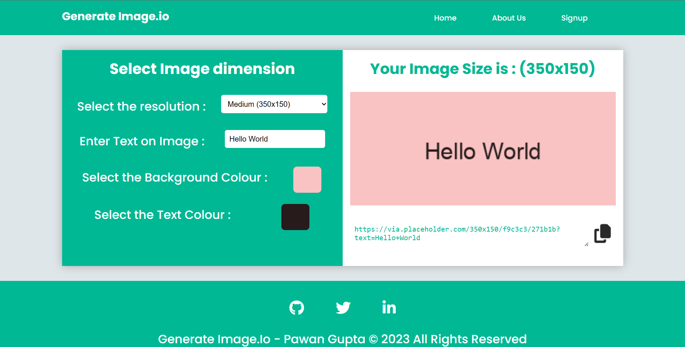

# Custom Placeholder Image Generator

A simple and customizable web tool that generates placeholder images of varying dimensions and colors. Quickly create placeholder images for your web development projects with customizable sizes and background colors.



## Features

- Generate placeholder images of various dimensions.
- Customize background colors to match your design.
- Quickly copy generated image URLs for easy integration into your projects.

## Getting Started

1. Clone the repository:

   ```sh
   git clone https://github.com/pawangupta5050/Custom-Placeholder-Image-Generator.git

## Usage

1. Open the `index.html` file in your preferred web browser.
2. Set the desired image width and height using the input fields.
3. Choose a background color using the color picker.
4. Click the "Generate Image" button to create your custom placeholder image.
5. Right-click on the generated image and select "Copy image address" to get the URL.
6. Use the copied URL in your HTML or CSS to display the placeholder image.

## Contributing

Contributions are welcome! If you have any ideas for improvements or new features, feel free to submit a pull request.

1. Fork the repository.
2. Create a new branch: `git checkout -b feature/my-feature`.
3. Make your changes and commit them: `git commit -m 'Add some feature'`.
4. Push the branch to your fork: `git push origin feature/my-feature`.
5. Open a pull request on the main repository.
